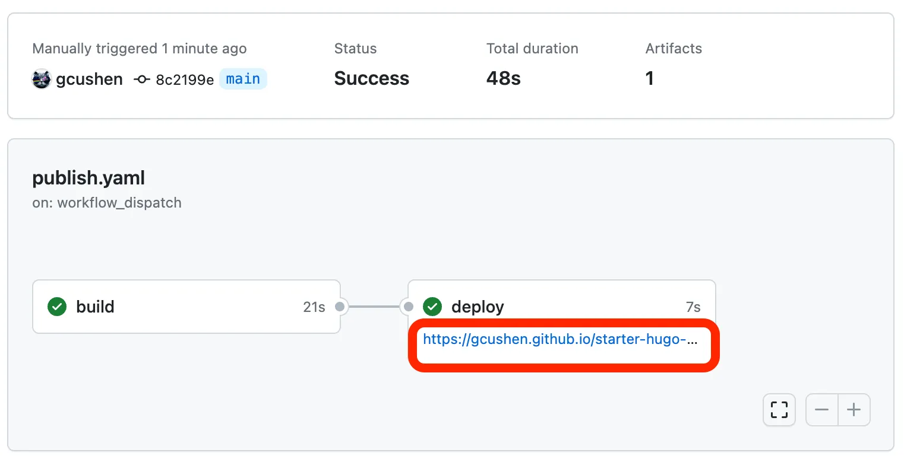

[](https://fadodo.github.io)

# 🚀 Build Your Academic Website with [Hugo Blox](https://docs.hugoblox.com/) on [GitHub Pages](https://pages.github.com/)  

A step-by-step guide to creating your own personal academic website without having to write any code using GitHub Pages and the Hugo framework.
Create a professional, customizable academic website using Hugo Blox and deploy it for free using GitHub Pages — all automated via GitHub Actions.

This guide is tailored for:

- Windows/Linux users

- Intermediate Git knowledge

- Automated deployment with GitHub Actions  

---

##  **Prerequisites**  
Ensure you have the following installed and set up before starting:
1. **Install Required Tools**  
   - **Git**: [Download Git](https://git-scm.com/)  and install it
   - **Hugo (Extended v0.124+)**  
     - *Linux*:  
       ```bash  
       sudo apt update && sudo apt install hugo  
       ```  
     - *Windows* (Using [Chocolatey](https://chocolatey.org/install)):  
       ```cmd  
       choco install hugo-extended -y  
       ```  
        Verify installation with `hugo version`. Ensure it says "extended".

2. **GitHub Account**  
   - Create one at [github.com](https://github.com) if you don’t have one yet.  

---


## **Step 1: Create Your Site Repository**  
1. **Fork the Hugo Blox Academic Template** 
   - Go to [Hugo Blox Academic Template](https://github.com/wowchemy/starter-hugo-academic) → click \"**Use this template**\" (top-right).
     
   - Name your repo as `username.github.io` (replace `username` with your actual GitHub username).  

2. **Clone the repository Locally**:  
   ```bash  
   git clone https://github.com/username/username.github.io  
   cd username.github.io  
   ```  

---

## **Step 2: Run the Website Locally**  
1. **Start a Live Preview Server** 
   ```bash  
   hugo server --buildDrafts  
   ```  
   - Open `http://localhost:1313` in your browser to view your site.  

2. **Understand the Hugo Blox Folder Structure**

    ```bash
    # Folder Structure After Cloning
    your-website/
    ├── config/          # Site configuration file
    ├── content/         # website cotent
    │   ├── home/        # Home page widgets (e.g., CV, publications)
    │   ├── publications/ # Research papers
    │   └── authors/     # Authors profile
    ├── themes/          # Hugo Blox theme
    └── .github/workflows # GitHub Actions deployment scripts
    ```
   - **Content Organization** 
     - Homepage widgets: `content/home/` 
        > E.g., `cv.md`, `publications.md`, `about.md`  
     - Academic content :
        - Publications  → `content/publications/`
        - Talks  → `content/talks/`
        - Projects  → `content/projects/`
    - Author profile → `content/authors/admin/_index.md`

   - **Front Matter Example**: Located at the top of `.md` files (YAML format)  
     
     ```yaml  
     title: "Curriculum Vitae"  
     widget: pages  
     active: true  
     date: 2025-07-21  
     ```  
---

## **Step 3: Customize Your Academic CV**  
1. **Edit CV section**
   - Open `content/home/cv.md`:  
     - Set `active: true` to enable the CV section.  
     - Adjust `widget: pages` → `widget: cv` for CV-specific layout.  

2. **Add Your Academic Profile** 
   - Create or edit `content/authors/admin/_index.md`:  
     ```yaml  
     education:  
       courses:  
         - course: Physical Oceanography and Application  
           institution: |
              🏛️ UPS (2013-2018)
            # ... other entries ...
           year: 2013 
     experience:  
       - position: |
            👨‍🏫 PhD  
         institution: |
            🏫 Université Paul Sabatier
         years: 2021-present  
     ```  

3. **Set Site Identity**
   - In `config/_default/params.yaml`:  
     ```yaml  
     title: \"Dr. Jane Doe\"  
     description: \"Water Flood Engineer\"  
     ```  

---

## **Step 4: Deploy Automatically with GitHub Actions**  
1. **Enable GitHub Pages**:  
In your GitHub repo: 
    - Go to **Settings → Pages → Build and deployment**
    - Set **Source** to **GitHub Actions**


2. **Commit Changes & Push** 
   ```bash  
   git add .  
   git commit -m "Initial setup"  
   git push origin main  
   ```  

3. **Verify Deployment**
GitHub Actions will:
   - run `.github/workflows/hugo.yaml` script

   

   - Deploy your site to `https://username.github.io` within ~2 minutes. 

   

For more detail see at [hugo_blox_docs](https://docs.hugoblox.com/reference/deployment/#github-pages)
---

## **Key Hugo Blox Concepts Explained**  
- **Widgets** 
Pre-built components (e.g., `cv`, `publications`). Enable/disable in `content/home/*.md`.
Enable them using:
```yaml
active: true
``` 
- **Front Matter Examples (Publication)** 

  ```yaml  
  # content/publications/my-paper.md  
  title: "Deep Learning Breakthrough"  
  publication: "Nature Journal"  
  doi: "10.123/abc"  
  ```  
- **Useful Content Folders**:  
  | Folder                  | Purpose                    |
  | ----------------------- | -------------------------- |
  | `content/publications/` | Individual research papers |
  | `content/projects/`     | Research projects          |
  | `content/talks/`        | Conference presentations   |

---

## **Troubleshooting Tips**  
- **Build Fails on GitHub?**
    - Check logs under **Actions  →  Hugo**
    - Common fixes:
        - Make sure **GitHub Actions is enabled**
        - Verify Hugo Extended is installed

- **Local Preview Issues?**
    - If themes are missing, run:
        ```bash
        hugo mod clean
        ``` 
  - Ensure your are using the **Extended** version:
      ```bash
    hugo version
    ```   
---

**Next Steps**

-  Add papers to `content/publications/`

-  Customize your theme and colors `config/_default/params.yaml`

-  Add a contact form via `content/home/contact.md`

-  Add projects and talks to respective folders

- Share your live website!

---

**Need Help?**

Feel free to reach out or ask questions if any step is unclear!
