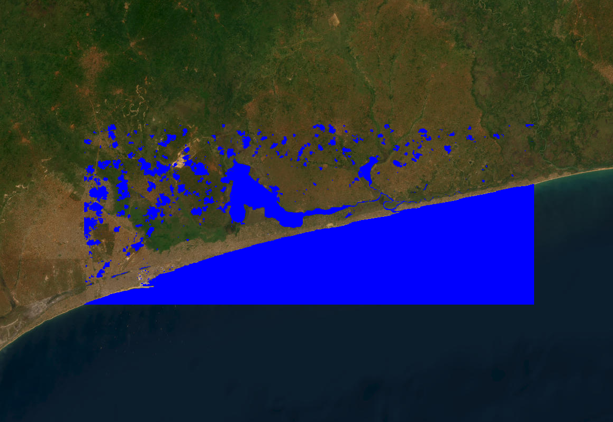

# Introduction

This guide will walk you through setting up and using the flood_mapper package to perform rapid flood mapping using Google Earth Engine (GEE)

**Note**: For the best experience, it's recommended to run this guide within a **VS Code environment** with the Python and Jupyter extensions installed. The images below are placeholders; you would replace them with actual screenshots from your setup.

# Overview

The `flood_mapper` package is a Python-based tool designed for rapid and flexible mapping of flooded areas using Google Earth Engine (GEE). It leverages pre- and post-event satellite imagery from Sentinel-1 (Synthetic Aperture Radar - SAR) and Sentinel-2 (optical) to detect flood extents. The package offers users the flexibility to choose their preferred detection method and handles data ingestion, preprocessing, flood detection, and export of results to Google Earth Engine Assets.

# Features

* **Flexible Flood Detection:** Choose to perform flood detection using:

  * **Sentinel-1 SAR data only (`--detection_method sar`):** Ideal for all-weather, day/night conditions, crucial when optical imagery is obscured by clouds.

  * **Sentinel-2 optical data only (`--detection_method s2`):** Utilizes NDWI for water detection, effective in clear-sky conditions.

  * **Both Sentinel-1 and Sentinel-2 data (`--detection_method both` - default):** Provides comprehensive analysis by leveraging the strengths of both data types.

* **Automated Data Ingestion:** Seamlessly fetches Sentinel-1 GRD and Sentinel-2 (Surface Reflectance) imagery from Google Earth Engine.

* **Image Preprocessing:** Includes speckle smoothing for SAR images and NDWI calculation for Sentinel-2.

* **Otsu Thresholding:** Dynamically computes thresholds for water/flood detection. Offers an **optional specific GeoJSON for Otsu threshold computation (`--otsu_aoi_path`)** for improved accuracy in complex terrains or specific water bodies.

* **Topological Refinement:** Refines flood extents based on connected pixels and terrain slope to remove noise and spurious detections.

* **Area Calculation:** Quantifies the extent of detected flooded areas in square kilometers.

* **Export to GEE Assets:** Export processed flood extent maps and other results directly to your Google Earth Engine Assets for persistent storage and further analysis within the GEE platform.

* **Command-Line Interface:** Easy-to-use script for running flood mapping workflows.

# Installation

## 1. **Prerequisites**
Before you begin, ensure you have the following installed:

- **Python 3.9+**:  Recommended to use with Anaconda/Miniconda for environment management.

- **Anaconda/Miniconda**:  For creating isolated Python environments.

- **Google Earth Engine (GEE) Account**: You need an active GEE account.

- **GEE Python API Authenticated**: You must have authenticated your GEE Python API.

## 2. **Setup Your Environment** 
Follow these steps to set up your development environment and install the `flood_mapper` package.

### **Step 2.1: Clone the Repository**
First, clone the `flood_mapper` repository from GitHub to your local machine on your terminal:

```bash

git clone https://github.com/fadodo/flood_mapper.git
cd flood_mapper      # Navigate into the cloned directory

```

### **Step 2.2: Create and Activate a Conda Environment**
It's best practice to create a dedicated Conda environment for `flood_mapper` to manage its dependencies.

```bash

conda create -n flood_mapper python=3.9
conda activate flood_mapper  # activate the environnement

```

### **Step 2.3: Install `flood_mapper` and Dependencies**
Install the `flood_mapper` package in "editable" mode, along with `jupyter`, `geemap`, `numpy`, `pandas` and `matplotlib`. The editable install (`-e .`) ensures that any changes you make to the package's source code are immediately reflected without needing to reinstall.

```bash

pip install -e .
pip install jupyter geemap numpy matplotlib pandas

```

### **Step 2.4: Authenticate Google Earth Engine**

If you haven't already, authenticate your Google Earth Engine Python API. This will open a browser window for you to log in with your Google account and grant access.

```bash

earthengine authenticate

```

### **Step 2.5: Install `ipykernel` for Jupyter**
This step ensures that your Jupyter Notebook can use the newly created flood_mapper kernel.

```bash

python -m ipykernel install --user --name=flood_mapper --display-name "Python (flood_mapper)"

```

#  Running the Flood Mapping Notebook

Now that your environment is set up, you can run the flood mapping process using the provided Jupyter Notebook.

## **Step 1: Launch Jupyter Lab**

From your activated flood_mapper terminal, launch Jupyter Lab.

```bash

jupyter lab

```
This will open Jupyter Lab in your web browser.


## **Step 2: Open the Notebook and Select Kernel**

In the Jupyter Lab interface, navigate to `run_flood_mapping.ipynb` and open it. Once opened, ensure you select the correct kernel: *Python (flood_mapper)*. You can usually find the kernel selector in the top-right corner of the notebook.


## **Step 3: Configure Parameters**

Scroll to the "2. Parameter Definition" section in the notebook. Here, you can customize the flood event date, **Area of Interest (AOI)**, and detection method.

- `event_date_str`: The date of the flood event (e.g., '2025-06-02').

- `aoi_geojson_path`: Path to a GeoJSON file defining your main AOI.  If None, a default AOI over Lomé, Togo, will be used.

- `otsu_aoi_geojson_path`: Path to a GeoJSON file for the Otsu threshold calculation.

 ⚠️ **IMPORTANT** ⚠️ : It is imperative that you use the data from your study area. This is crucial for SAR-based detection accuracy. 
The area selected for this purpose should be situated in close proximity to a body of water, such as a river, lake or stream, on one side and unobstructed land on the other. If `None`, a default small polygon over Lac Togo will be used for the demo. 

- `sar_search_days / s2_search_days`: Number of days before/after the event date to search for satellite images. 

⚠️ **IMPORTANT** ⚠️: Please be aware that the revisit period for these satellites is 12 days. **It is imperative to set this value from 12 to guarantee that we have at least one image before and after the event date**.

- `export_results`: Set to `True` if you want to export the final flood maps to your GEE Assets.

- `asset_id_prefix`: ⚠️ **IMPORTANT** ⚠️ Change this to your GEE asset path (e.g., `'users/your_username/FloodMappingResults/'`).

- `detection_method`: Choose **'sar'**, **'s2'**, or **'both'** for the detection method.

Otsu threshold calculation region that overlaps water and land 


Otsu threshold calculation region whitin the region of interest


## **Step 4: Run All Cells**

Execute all cells in the notebook sequentially. You can do this by going to `Run` > `Run All` Cells in the Jupyter menu. The notebook will print progress updates in the output cells.


# **Interpreting Results**

After the notebook finishes execution, you will see various outputs.

## **Step 1: Console Output**
The notebook will print messages indicating data availability, processing steps, and calculated flood areas (in km²). Pay attention to any warnings, especially regarding image availability or pixel count consistency.


## **Step 2: Interactive Map Visualization**
The most exciting part! An interactive geemap map will be displayed directly within the notebook. This map will show:

- **Main AOI (Blue Outline)**: Your defined Area of Interest.

- **Otsu AOI (Green Outline)**: The specific region used for Otsu threshold calculation (if provided).

- **Pre-event and Post-event SAR imagery**: Original SAR images.

- **Pre-event and Post-event SAR Water Masks**: Binary masks showing water before and after the event (derived from SAR).

- **Pre-event and Post-event NDWI Water Masks**: Binary masks showing water before and after the event (derived from Sentinel-2 NDWI).

- **SAR-based Effective Flood Extent (Red)**: The final flood extent derived from SAR, refined by topology.

- **Sentinel-2 NDWI-based Flood Extent (Purple)**: The flood extent derived from Sentinel-2 NDWI.

- **Flood Duration (Color Scale)**: A placeholder layer indicating flood duration (currently a single day where flood is detected).

You can toggle layers on/off and zoom in/out to explore the results.


## **Step 3: Exported Assets (Optional)**

If export_results was set to `True`, the notebook will initiate tasks to export the flood extent and duration images to your Google Earth Engine Assets. You can monitor the progress of these tasks in your GEE Code Editor's "Tasks" tab.


# **Accuracy Considerations**
Remember that the accuracy of the flooded area calculation can be influenced by several factors:

- **Sentinel-2 (Optical) Data**: The primary limitation is **cloud cover**. Clouds and cloud shadows can obscure the ground, leading to underestimation of flooded areas or false positives. Clear-sky images are crucial.

- **Sentinel-1 (SAR) Data**: While SAR penetrates clouds, the accuracy relies on the precise **Otsu threshold determination**. Factors like vegetation, urban areas, and varying water surface conditions can affect backscatter, making a universally optimal threshold challenging.

# **Others image outputs**

- SAR imagery 


- SAR water/land mask 


- Sentinel 2 NDWI mask 

  **Note** : Despite the filtering of 30% cloud coverage, it should be noted that Sentinel-2 optical imagery is dominated by clouds.



- Flood extend from SAR

 

- Flood extend from SAR 

  **Note** : Despite the filtering of 30% cloud coverage, it should be noted that Sentinel-2 optical imagery is dominated by clouds.

 

---
🔥🔥 **You are now ready to use `flood_mapper` for your flood analysis! Feel free to experiment with different parameters and AOIs.**
---
